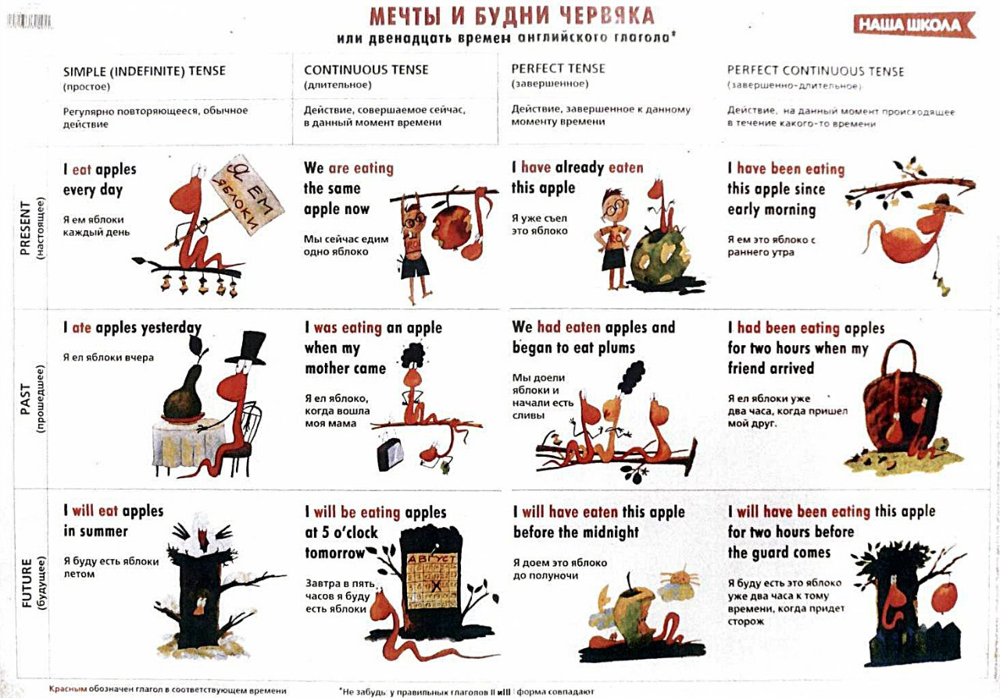

# Времена глаголов

# Согласование времён и косвенная речь в английском языке

## Таблица с примерами согласования времён

| Прямая речь             | Время в прямой речи    | Косвенная речь                 | Время в косвенной речи   |
|-------------------------|------------------------|--------------------------------|--------------------------|
| She says, "I am happy." | Present Simple         | She said that she was happy.   | Past Simple              |
| He says, "I am working."| Present Continuous     | He said that he was working.   | Past Continuous          |
| They say, "We have seen him." | Present Perfect      | They said that they had seen him. | Past Perfect             |
| She says, "I have been waiting." | Present Perfect Continuous | She said that she had been waiting. | Past Perfect Continuous   |
| He says, "I will go."   | Future Simple          | He said that he would go.      | Future in the Past       |
| I say, "I can swim."    | Modal (can)            | I said that I could swim.      | Modal (could)            |
| She said, "I was happy."  | Past Simple            | She said that she had been happy.| Past Perfect               |
| He said, "I was working." | Past Continuous        | He said that he had been working.| Past Perfect Continuous    |
| They said, "We had seen him." | Past Perfect           | They said that they had seen him. | Past Perfect               |
| She said, "I had been waiting." | Past Perfect Continuous | She said that she had been waiting. | Past Perfect Continuous     |
| He said, "I would go."    | Future in the Past     | He said that he would go.        | Future in the Past         |
| I said, "I could swim."   | Modal (could)          | I said that I could swim.        | Modal (could)              |

## Слова-указатели времени и места

| Прямая речь | Косвенная речь |
|-------------|----------------|
| today       | that day       |
| tomorrow    | the next day   |
| yesterday   | the previous day / the day before |
| now         | then           |
| here        | there          |
| this        | that           |
| these       | those          |

# Числительные в английском языке

## Количественные числительные (Cardinal Numbers)

Количественные числительные используются для обозначения количества.

| Число     | Числительное    |
|-----------|-----------------|
| 0         | zero            |
| 1         | one             |
| 2         | two             |
| 3         | three           |
| 4         | four            |
| 5         | five            |
| 6         | six             |
| 7         | seven           |
| 8         | eight           |
| 9         | nine            |
| 10        | ten             |
| 11        | eleven          |
| 12        | twelve          |
| 13        | thirteen        |
| 14        | fourteen        |
| 15        | fifteen         |
| 16        | sixteen         |
| 17        | seventeen       |
| 18        | eighteen        |
| 19        | nineteen        |
| 20        | twenty          |
| 21        | twenty-one      |
| 22        | twenty-two      |
| 23        | twenty-three    |
| 24        | twenty-four     |
| 25        | twenty-five     |
| 26        | twenty-six      |
| 27        | twenty-seven    |
| 28        | twenty-eight    |
| 29        | twenty-nine     |
| 30        | thirty          |
| 40        | forty           |
| 50        | fifty           |
| 60        | sixty           |
| 70        | seventy         |
| 80        | eighty          |
| 90        | ninety          |
| 100       | one hundred     |
| 1,000     | one thousand    |
| 1,000,000 | one million     |

## Порядковые числительные (Ordinal Numbers)

Порядковые числительные используются для обозначения порядка.

| Число     | Числительное      |
|-----------|-------------------|
| 1st       | first             |
| 2nd       | second            |
| 3rd       | third             |
| 4th       | fourth            |
| 5th       | fifth             |
| 6th       | sixth             |
| 7th       | seventh           |
| 8th       | eighth            |
| 9th       | ninth             |
| 10th      | tenth             |
| 11th      | eleventh          |
| 12th      | twelfth           |
| 13th      | thirteenth        |
| 14th      | fourteenth        |
| 15th      | fifteenth         |
| 16th      | sixteenth         |
| 17th      | seventeenth       |
| 18th      | eighteenth        |
| 19th      | nineteenth        |
| 20th      | twentieth         |
| 21st      | twenty-first      |
| 22nd      | twenty-second     |
| 23rd      | twenty-third      |
| 24th      | twenty-fourth     |
| 25th      | twenty-fifth      |
| 26th      | twenty-sixth      |
| 27th      | twenty-seventh    |
| 28th      | twenty-eighth     |
| 29th      | twenty-ninth      |
| 30th      | thirtieth         |
| 40th      | fortieth          |
| 50th      | fiftieth          |
| 60th      | sixtieth          |
| 70th      | seventieth        |
| 80th      | eightieth         |
| 90th      | ninetieth         |
| 100th     | hundredth         |
| 1,000th   | thousandth        |

## Слова для обозначения количества

### Many и Much

**Many** используется с исчисляемыми существительными.

- How **many** apples do you have?
- There are **many** cars on the road.

**Much** используется с неисчисляемыми существительными.

- How **much** water do you need?
- She doesn’t have **much** time.

### Few и Little

**Few** используется с исчисляемыми существительными и имеет негативный оттенок, означая "мало" или "почти нет".

- There are **few** cookies left in the jar.
- **Few** people attended the meeting.

**Little** используется с неисчисляемыми существительными и также имеет негативный оттенок, означая "мало" или "почти
нет".

- There is **little** milk in the fridge.
- She has **little** patience.

### A Few и A Little

**A few** используется с исчисляемыми существительными и имеет позитивный оттенок, означая "несколько".

- I have **a few** friends in this city.

**A little** используется с неисчисляемыми существительными и также имеет позитивный оттенок, означая "немного".

- I need **a little** help with this.

### Примеры использования

1. **Many** vs. **Much**:
    - **Many** students like this teacher.
    - She doesn’t have **much** money.
2. **Few** vs. **Little**:
    - There are **few** books on the shelf.
    - There is **little** sugar in the bowl.
3. **A few** vs. **A little**:
    - I have **a few** friends in this city. (несколько друзей)
    - I need **a little** help with this. (немного помощи)
4. **Several** (для исчисляемых существительных):
    - He has **several** hobbies.
5. **A lot of** / **Lots of**:
    - There are **a lot of** people in the park.
    - She has **lots of** experience in this field.

## Комбинированные примеры

1. **Using ordinal and cardinal numbers together**:
    - She is the **second** of **three** children.
    - He finished the race in **third** place out of **fifty** runners.
2. **Many, much, few, little** in context:
    - How **many** cookies did you bake? I baked **twenty** cookies.
    - How **much** flour did you use? I used **a little** flour.
    - **Few** people understand quantum mechanics, but **many** try to learn.
    - There is **little** hope of success, but we must try our best.

# Модальные глаголы (can, could, may, might, must, shall, should, will, would)

## Can:

Возможность или умение: "I can swim."
Разрешение: "Can I leave early?"

## Could:

Прошедшая форма "can": "I could swim when I was a child."
Вежливая просьба: "Could you help me?"
Возможность в настоящем или будущем: "It could rain tomorrow."

## May:

Разрешение: "May I come in?"
Возможность: "It may rain later."

## Might:

Меньшая вероятность, чем "may": "It might rain tomorrow."
Вежливая просьба (редко): "Might I suggest an alternative?"

## Must:

Необходимость или обязательство: "You must wear a seatbelt."
Высокая степень вероятности: "She must be at home."

## Shall:

Предложение или предложение сделать что-то: "Shall we dance?"
Будущее время (устаревающее использование, в основном в британском английском): "I shall return."

## Should:

Совет или рекомендация: "You should see a doctor."
Ожидание или вероятность: "She should be here by now."

## Will:

Будущее время: "I will call you tomorrow."
Готовность или намерение: "I will help you."

## Would:

Вежливая просьба: "Would you pass the salt?"
Условное наклонение: "I would go if I had time."
Привычное действие в прошлом: "When I was a child, I would play outside all day."

# Пассивный залог (Passive Voice)

| Время                | Активный залог                 | Пассивный залог                   |
|----------------------|--------------------------------|-----------------------------------|
| Present Simple       | The chef cooks the meal.       | The meal is cooked by the chef.   |
| Past Simple          | The chef cooked the meal.      | The meal was cooked by the chef.  |
| Future Simple        | The chef will cook the meal.   | The meal will be cooked by the chef. |
| Present Continuous   | The chef is cooking the meal.  | The meal is being cooked by the chef. |
| Past Continuous      | The chef was cooking the meal. | The meal was being cooked by the chef. |
| Present Perfect      | The chef has cooked the meal.  | The meal has been cooked by the chef. |
| Past Perfect         | The chef had cooked the meal.  | The meal had been cooked by the chef. |
| Future Perfect       | The chef will have cooked the meal. | The meal will have been cooked by the chef. |
| Can                  | You can solve this problem.    | This problem can be solved.       |
| Must                 | They must finish the project.  | The project must be finished.     |

# Условные предложения (Conditional Sentences: Type 0, 1, 2, 3, Mixed)

